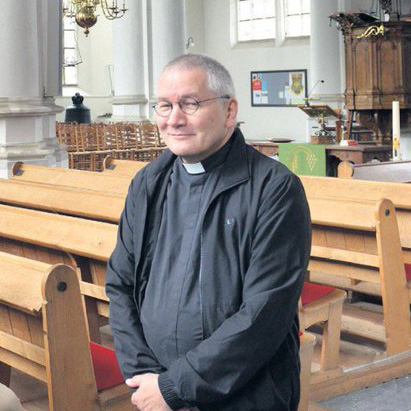

  <h1 class="hero-title">Welkom bij de parochie van de Heilige Martelaren van Gorcum</h1>
  
  

    ...laden...
  

## Laatste berichten

Loading...

<a href="/berichten/index.html" class="button" >Alle berichten</a>
---

## Vaste quote

  

  

    

      “Sinds het overlijden van Pastoor De Jong vier ik de Mis in deze parochie, en wat mij telkens opnieuw treft is de warmte en oprechte betrokkenheid van de gemeenschap. Het is een vreugde om hier te mogen dienen.”
    

    

      Pastoor Meijer
      Sinds het overlijden van Pastoor de Jong viert Pastoor Meijer de Mis in onze parochie.
    

  

## Random quote

  

    
    

      

        “Samen met mijn gezin naar de Mis gaan is voor mij een van de mooiste momenten van de week. Het brengt rust, verbondenheid en herinnert ons aan wat echt belangrijk is.”
      

      

        Olivier
        Beheerder van de website en redactielid.
      

    

  

  

    
    

      

        “Sinds ik hier kom, heb ik weer rust gevonden. De gemeenschap voelt als een tweede thuis.”
      

      

        Kevin Kraaijveld
        Parochiaan sinds 2025
      

    

  

  

    
    

      

        “Sinds het overlijden van Pastoor De Jong vier ik de Mis in deze parochie, en wat mij telkens opnieuw treft is de warmte en oprechte betrokkenheid van de gemeenschap. Het is een vreugde om hier te mogen dienen.”
      

      

        Pastoor Meijer
        Sinds het overlijden van Pastoor de Jong viert Pastoor Meijer de Mis in onze parochie.
      

    

  

## Quote slider

  

    
    

      

        “Samen met mijn gezin naar de Mis gaan is voor mij een van de mooiste momenten van de week. Het brengt rust, verbondenheid en herinnert ons aan wat echt belangrijk is.”
      

      

        Olivier
        Beheerder van de website en redactielid.
      

    

  

  

    
    

      

        “Sinds ik hier kom, heb ik weer rust gevonden. De gemeenschap voelt als een tweede thuis.”
      

      

        Kevin Kraaijveld
        Parochiaan sinds 2025
      

    

  

  

    
    

      

        “Sinds het overlijden van Pastoor De Jong vier ik de Mis in deze parochie, en wat mij telkens opnieuw treft is de warmte en oprechte betrokkenheid van de gemeenschap. Het is een vreugde om hier te mogen dienen.”
      

      

        Pastoor Meijer
        Sinds het overlijden van Pastoor de Jong viert Pastoor Meijer de Mis in onze parochie.
      

    

  

---

## Over ons

De parochie van Gorinchem heeft de <a href="/artikelen/de-martelaren-van-gorcum.html">Heilige Martelaren van Gorcum</a> als patronen. Zij vormt met de parochie de <a href="http://heiligedrieeenheid.eu" target="_blank" rel="noopener">Heilige Drie-eenheid</a> de federatie het <a href="/overons.html#het-driestromenland">Driestromenland</a>. Beide parochies behoren tot het <a href="https://www.bisdomrotterdam.nl/">bisdom Rotterdam</a>.

De parochie wil de missie tot uitvoer brengen. In woord en daad wil zij Christus verkondigen in deze maatschappij. Het is en blijft de droom van de Kerk dat steeds meer mensen Christus leren kennen als fundament in hun leven. Het ideaal van het pastoraal team is dat parochies gelovige, liefdevolle en geëngageerde gemeenschappen zijn.

    
<a href="overons.html" class="button">Lees verder →</a>

---

## In Memoriam

  
  

    
Op zondag 16 november is pastoor De Jong van Gorinchem onverwacht overleden. Hij werd thuis aangetroffen en is gestorven aan een acute hartstilstand. Pastoor De Jong mocht 62 jaar oud worden.

    
<a href="inmemoriam.html" class="button">Lees verder →</a>

  

---

## Onze parochie

  <a href="parochie/vieren/" class="grid-item">
    <h3>Samen vieren</h3>
    
De Eucharistie en sacramenten vieren als hart van ons geloof.

  </a>
  <a href="parochie/leren/" class="grid-item">
    <h3>Samen leren</h3>
    
Groeien in geloof door catechese en verdieping.

  </a>
  <a href="parochie/dienen/" class="grid-item">
    <h3>Samen dienen</h3>
    
Omzien naar elkaar, in navolging van Christus.

  </a>
  <a href="parochie/bidden/" class="grid-item">
    <h3>Samen bidden</h3>
    
Persoonlijk en gezamenlijk gebed als hart van ons leven.

  </a>
  <a href="parochie/gemeenschap/" class="grid-item">
    <h3>Onze gemeenschap</h3>
    
Verbondenheid binnen de parochie en daarbuiten.

  </a>
  <a href="parochie/roosters/" class="grid-item">
    <h3>Roosters</h3>
    
Overzicht van vieringen en pastorale activiteiten.

  </a>

